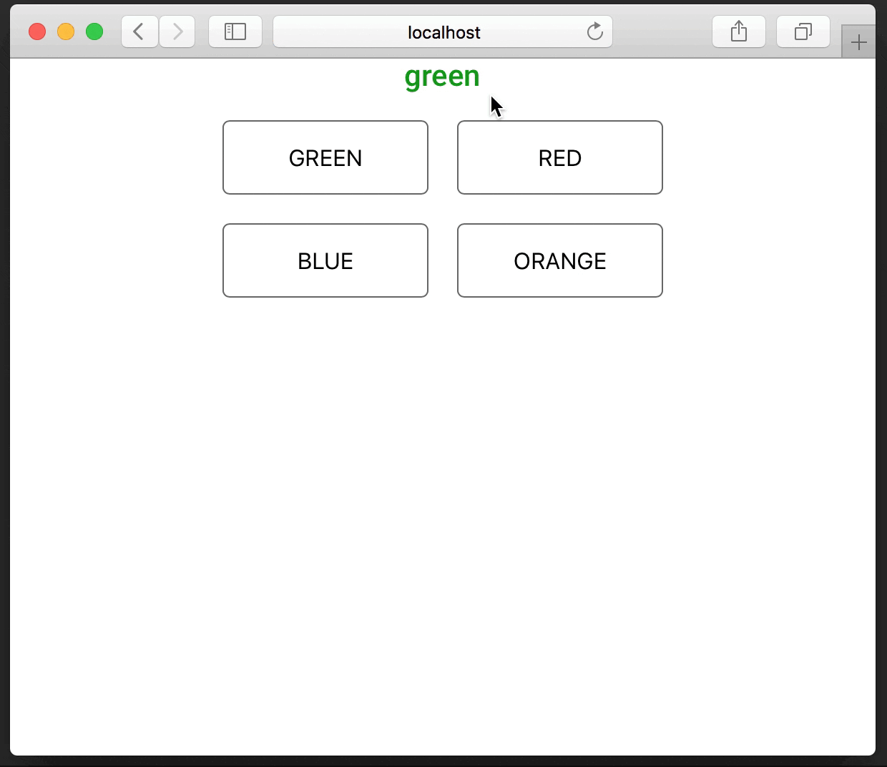

# ORCATECH Stroop Test

[](https://travis-ci.org/orcatechteam/react-neuropsych-stroop)

A Stroop test implemented as a [React](https://reactjs.org) component.



## Install

The ORCATECH Stroop test is available as an [NPM package](https://www.npmjs.com/package/@orcatech/react-neuropsych-stroop).

```sh
npm install @orcatech/react-neuropsych-stroop
```

## Demo

After installing, open the
[Stroop Test Demo](dist/test/index.html)

## Usage

Here's a quick example to get you started:

```javascript
import React from 'react';
import ReactDOM from 'react-dom';
import Stroop from 'react-neuropsych-stroop';

const words = ['green', 'red', 'blue', 'orange'];
const colors = ['009900', '990000', '000099', 'EE7600']
const combos = [
	{ word: 0, color: 0 },
	{ word: 1, color: 1 },
	{ word: 2, color: 2 },
	{ word: 3, color: 3 },
	{ word: 0, color: 1 },
	{ word: 2, color: 3 },
	{ word: 3, color: 2 },
	{ word: 1, color: 0 },
];

class App extends React.Component {
  onComplete = (completionData) => {
    // handle test completion
    const { errors, successes, begin, finish, timeLimitReached } = completionData;
  }

  onSuccess = (data) => {
    // handle each success that occurs
  }

  onError = (data) => {
    // handle each error that occurs
  }

  render() {
    return (
      <Stroop
        colors={colors}
        combos={combos}
        onComplete={this.handleComplete}
        onError={this.handleError}
        onSuccess={this.handleSuccess}
        words={words}
      />
    );
  }
}

ReactDOM.render(<App />, document.querySelector('#app'));
```

## Props

| Name              | Type   | Default                           | Description                                                                                                                                                                                                                                                   |
| ----------------- | ------ | --------------------------------- | ------------------------------------------------------------------------------------------------------------------------------------------------------------------------------------------------------------------------------------------------------------- |
| buttonsPerRow     | number | 2                                 | The number of buttons per row                                                                                                                                                                                                                                 |
| colors            | array  |                                   | An array of RGB hex colors values without the `#`. These should match the items in the `words` array. <br><br> `['009900', '990000', '000099', 'EE7600']`                                                                                                     |
| combos            | array  |                                   | An array of objects with a shape of color and word that refer to their respective array index. Each combination is used for each task and the correct button press is based on the color value. <br><br> `[{ word: 0, color: 1 }, { word: 1, color: 2 }]`     |
| completionMessage | string | `'Completed! Please press next.'` | The message that is shown when the test is completed.                                                                                                                                                                                                         |
| incorrectMessage  | string | `'Incorrect, please try again'`   | The message that is show when an incorrect button was pressed.                                                                                                                                                                                                |
| onComplete        | func   |                                   | Callback fired when the test is completed <br><br> `function (completionData: object) => void` <br> _completionData_: an object with the following keys <br> &nbsp;&nbsp; `errors, successes, begin, finish, timeLimitReached`                                |
| onSuccess         | func   |                                   | Callback fired when a correct button was pressed <br><br> `function (data) => void` <br> _data_: an object with the following keys <br> &nbsp;&nbsp; `{ stamp: number, index: number, word: string, color: string, start: timestamp, selectedColor: string }` |
| onError           | func   |                                   | Callback fired when an incorrect button was pressed <br><br> `function (data) => void` <br> _data_: an object with the following keys <br> &nbsp;&nbsp; `stamp, index, word, color, start, selectedColor`                                                     |
| timeLimit         | number | `45000`                           | Milliseconds for the time limit of the test. Use `0` to disable the time limit.                                                                                                                                                                               |
| words             | array  |                                   | An array of keywords for each color. These should match the items in the `colors` array. <br><br> `['green', 'red', 'blue', 'orange']`                                                                                                                        |
